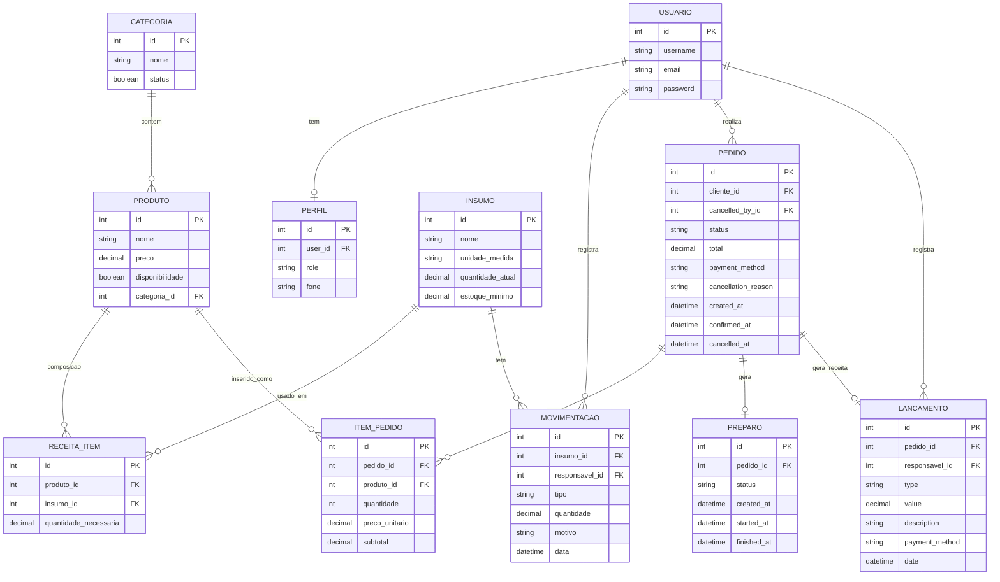

# Diagrama Entidade-Relacionamento (DER)

O diagrama abaixo ilustra as entidades principais do TCC ERP e seus relacionamentos:

```mermaid
erDiagram
    USUARIO {
        int id PK
        string username
        string email
        string password
    }
    
    PERFIL {
        int id PK
        int user_id FK
        string role
        string fone
    }
    
    CATEGORIA {
        int id PK
        string nome
        boolean status
    }
    
    PRODUTO {
        int id PK
        string nome
        decimal preco
        boolean disponibilidade
        int categoria_id FK
    }
    
    INSUMO {
        int id PK
        string nome
        string unidade_medida
        decimal quantidade_atual
        decimal estoque_minimo
    }
    
    RECEITA_ITEM {
        int id PK
        int produto_id FK
        int insumo_id FK
        decimal quantidade_necessaria
    }
    
    MOVIMENTACAO {
        int id PK
        int insumo_id FK
        int responsavel_id FK
        string tipo
        decimal quantidade
        string motivo
        datetime data
    }
    
    PEDIDO {
        int id PK
        int cliente_id FK
        int cancelled_by_id FK
        string status
        decimal total
        string payment_method
        string cancellation_reason
        datetime created_at
        datetime confirmed_at
        datetime cancelled_at
    }
    
    ITEM_PEDIDO {
        int id PK
        int pedido_id FK
        int produto_id FK
        int quantidade
        decimal preco_unitario
        decimal subtotal
    }
    
    PREPARO {
        int id PK
        int pedido_id FK
        string status
        datetime created_at
        datetime started_at
        datetime finished_at
    }
    
    LANCAMENTO {
        int id PK
        int pedido_id FK
        int responsavel_id FK
        string type
        decimal value
        string description
        string payment_method
        datetime date
    }

    %% Relacionamentos
    USUARIO ||--o| PERFIL : tem
    CATEGORIA ||--o{ PRODUTO : contem
    
    PRODUTO ||--o{ RECEITA_ITEM : composicao
    INSUMO ||--o{ RECEITA_ITEM : usado_em
    
    INSUMO ||--o{ MOVIMENTACAO : tem
    USUARIO ||--o{ MOVIMENTACAO : registra
    
    USUARIO ||--o{ PEDIDO : realiza
    PEDIDO ||--o{ ITEM_PEDIDO : contem
    PRODUTO ||--o{ ITEM_PEDIDO : inserido_como
    
    PEDIDO ||--o| PREPARO : gera
    PEDIDO ||--o| LANCAMENTO : gera_receita
    USUARIO ||--o{ LANCAMENTO : registra
```
